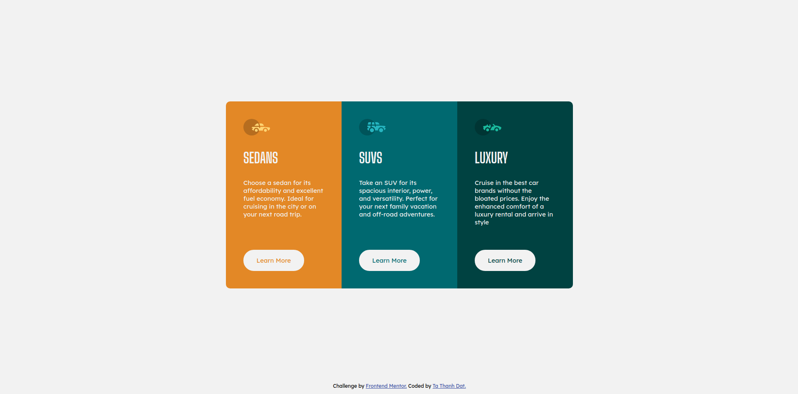

# Frontend Mentor - 3-column preview card component solution

This is a solution to the [3-column preview card component challenge on Frontend Mentor](https://www.frontendmentor.io/challenges/3column-preview-card-component-pH92eAR2-). Frontend Mentor challenges help you improve your coding skills by building realistic projects. 

### The challenge

Users should be able to:

- View the optimal layout depending on their device's screen size
- See hover states for interactive elements

### Screenshot

Desktop Version

Mobile Version

### Links
- [Live site](https://tathanhdat.github.io/3-column-preview-card-component/)

### Built with

- Semantic HTML5 markup
- CSS custom properties
- Flexbox
- Mobile-first workflow

## Author

- Website - [Ta Thanh Dat](https://www.facebook.com/tathanh.dat.5/)
- Frontend Mentor - [@Ta Thanh Dat](https://www.frontendmentor.io/profile/tathanhdat)
